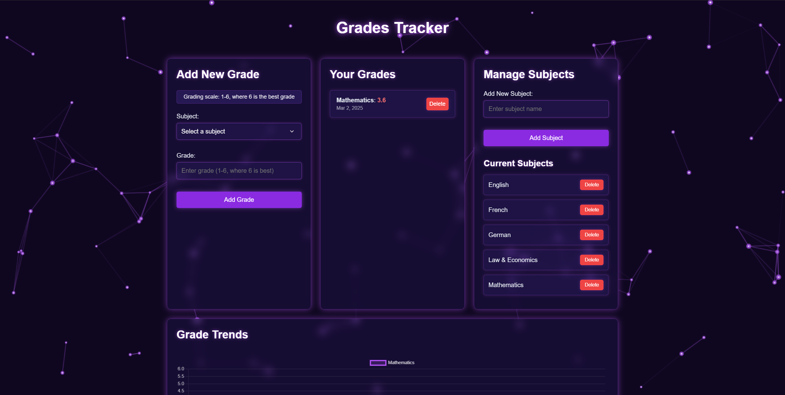

# Grades Tracker

A sleek, modern web application for tracking and visualizing academic grades with a neon purple aesthetic. This application helps students monitor their academic performance across different subjects, visualize grade trends over time, and manage their subject list.



## Features

- ✨ Stunning neon purple UI with glass-like panels
- 📊 Interactive grade trend visualization with Chart.js
- 🔄 Dynamic subject management system
- 🎨 Animated neural network background
- 💫 Captivating loading animation sequence
- 📱 Fully responsive design for all device sizes
- 🌈 Color-coded grade indicators
- 🔒 Persistent data storage

## Technologies Used

- **Frontend**: HTML5, CSS3, JavaScript (ES6+)
- **Backend**: Node.js, Express.js
- **Data Visualization**: Chart.js
- **Storage**: File-based JSON storage
- **Containerization**: Docker
- **ID Generation**: UUID

## Installation & Setup

### Prerequisites

- Docker and Docker Compose installed on your system
- Git for cloning the repository

### Quick Start

1. Clone the repository:
   ```bash
   git clone https://github.com/AdminGodZ/grades-tracker.git
   cd grades-tracker
   ```

2. Start the application using Docker Compose:
   ```bash
   docker compose up -d --build
   ```

3. Access the application in your browser:
   ```
   http://localhost:4000
   ```

### Manual Setup (Without Docker)

1. Ensure Node.js is installed on your system
2. Install the dependencies:
   ```bash
   npm install
   ```

3. Start the application:
   ```bash
   npm start
   ```

4. Access the application in your browser:
   ```
   http://localhost:3000
   ```

## Project Structure

```
.
├── Dockerfile              # Docker container configuration
├── compose.yml            # Docker Compose configuration
├── package.json           # Project dependencies
├── server.js              # Express server and API endpoints
├── data/                  # Data storage directory
│   ├── grades.json        # Stored grades data
│   └── subjects.json      # Stored subjects data
└── public/                # Static assets
    ├── index.html         # Main HTML file
    ├── style.css          # CSS styles
    ├── script.js          # Main JavaScript file
    ├── background.js      # Neural network background animation
    ├── loading-animation.js # Loading screen animation
    └── grade_analytics_logo.svg # Logo file
```

## Usage

### Adding Grades

1. Select a subject from the dropdown list
2. Enter a grade between 1 and 6 (where 6 is the best grade)
3. Click "Add Grade"

### Managing Subjects

1. Go to the "Manage Subjects" panel
2. Enter a new subject name
3. Click "Add Subject"
4. To remove a subject, click the "Delete" button next to it (subjects in use cannot be deleted)

### Viewing Grade Trends

The "Grade Trends" section displays a line chart showing grade progression for each subject over time. Each subject is represented by a different color for easy identification.

## Data Storage

- All data is stored locally in the `data/` directory
- `grades.json` contains all your grade entries
- `subjects.json` contains your list of subjects

When using Docker, the data directory is mounted as a volume, ensuring your data persists between container restarts.

## Development

### Rebuilding After Changes

When making changes to the code, rebuild the Docker container to apply those changes:

```bash
docker compose up -d --build
```

### Adding Custom Styling

To modify the visual appearance:
- Edit `public/style.css` for general styling
- Edit `public/background.js` to modify the background animation
- Edit `public/loading-animation.js` to change the loading screen

## License

This project is licensed under the MIT License - see the LICENSE file for details.

## Contributing

Contributions are welcome! Please feel free to submit a Pull Request.

---

Created with ❤️ and lots of purple neon glow.